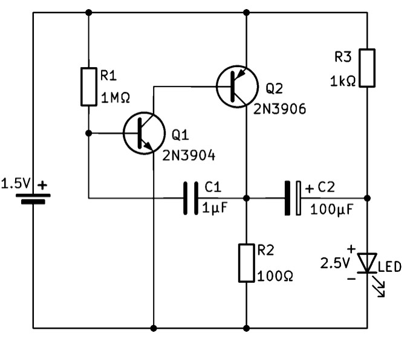

# Description

These 1.5V battery LED flashers are very popular Youtube, they seem simple, but how can we flash a 2.5V LED from a 1.5V battery?  
In this video we will take a closer look at this brilliant circuit,   
I will explain how the circuit works, simulate it with LTSpice and we will check the real circuit operation on the oscilloscope.

### Watch the YouTube video:
  

   

